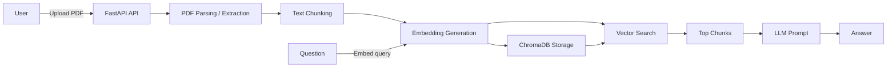

# 📄 AI PDF Agent

A FastAPI-based AI PDF assistant that extracts text from uploaded PDFs, creates embeddings, stores chunks in ChromaDB, and answers natural language questions with an OpenAI LLM.

## 🚀 Features

- 📄 Upload PDF files via `/upload-pdf/`
- 🔎 Extract text, split into chunks, and generate embeddings
- 🧠 Query PDF content with natural language using `/ask-pdf/`
- 🗂️ Store document chunks in ChromaDB for fast retrieval
- 🧹 List and delete uploaded documents via API
- 🧾 Health check endpoint for readiness monitoring

## 🏗️ Architecture

Upload PDF → Text extraction → Chunking → Embeddings → ChromaDB storage → Vector search → LLM response

## 📊 Architecture Diagram



## 🧰 Tech Stack

- Python 3.11
- FastAPI
- PyPDF2
- ChromaDB
- OpenAI embeddings and Chat API
- Uvicorn
- LangChain text splitter
- React + Vite

## 📦 Repository Structure

- `app/main.py` — FastAPI app and middleware
- `app/api/routes.py` — PDF upload, question answering, document listing/deletion
- `app/services/ai_service.py` — LLM prompt and OpenAI chat call
- `app/services/embedding_service.py` — text splitting, embeddings, cache
- `app/services/vector_db.py` — ChromaDB storage and search
- `app/core/config.py` — environment loading and OpenAI client
- `frontend/` — React UI built with Vite
- `requirements.txt` — Python dependencies
- `runtime.txt` — Python runtime version

## ⚙️ Setup Instructions

### 1. Create and activate a virtual environment

```bash
python3 -m venv venv
source venv/bin/activate
```

### 2. Install dependencies

```bash
pip install -r requirements.txt
```

### 3. Install frontend dependencies

```bash
cd frontend
npm install
```

### 4. Run tests

```bash
pytest tests
```

### 5. Add your OpenAI API key

Create a `.env` file in the repo root with:

```env
OPENAI_API_KEY=your_openai_api_key
```

### 5. Run the backend

```bash
uvicorn app.main:app --reload
```

By default, the API will be available at `http://127.0.0.1:8000`.

### 6. Run the frontend

```bash
cd frontend
npm run dev
```

By default, the frontend runs at `http://localhost:3000`.

## 🔌 API Endpoints

- `GET /` — health/status
- `GET /health` — readiness check
- `POST /upload-pdf/` — upload a PDF file
- `GET /ask-pdf/?question=...` — ask a question about uploaded PDF content
- `GET /documents` — list stored document IDs
- `DELETE /documents/{doc_id}` — delete a stored document from ChromaDB

## 🧪 Example Usage

Upload a PDF:

```bash
curl -X POST "http://127.0.0.1:8000/upload-pdf/" \
  -F "file=@/path/to/document.pdf"
```

Ask a question:

```bash
curl "http://127.0.0.1:8000/ask-pdf/?question=What+is+the+main+topic%3F"
```

List documents:

```bash
curl "http://127.0.0.1:8000/documents"
```

Delete a document:

```bash
curl -X DELETE "http://127.0.0.1:8000/documents/<doc_id>"
```

## 📝 Notes

- `chroma_db/` stores persistent vector data locally
- `temp.pdf` is used temporarily during upload processing
- The app uses a simple in-memory embedding cache to avoid recomputing duplicate chunks

## 📈 Future Improvements

- Add a web frontend or dashboard
- Support multiple document uploads per session
- Add authentication and access control
- Add scanned PDF OCR support
- Improve chunk selection and query prompting

## 👨‍💻 Author

Built by Nanda Rampura
